# **Behavioral Cloning** 

This project was created in order to implement behavioral cloning using deep neural networks, the idea was to implement supervised learning to predict steering angles of a car around some tracks in a simulator in Unity, the input were images and the output a Real value.

The results on both tracks can be seen below. The car drove autonomously on track 1 (100%), but in track 2 it required help in two curves 2/120 sec) about 98% driving accuracy on this difficult track. 

Track 1                       |  Track 2
:----------------------------:|:------------------------------:
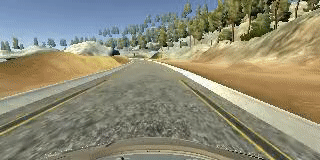 | 


**Behavioral Cloning Project**

The goals / steps of this project are the following:
* Use the simulator to collect data of good driving behavior
* Build, a convolution neural network in Keras that predicts steering angles from images
* Train and validate the model with a training and validation set
* Test that the model successfully drives around track one without leaving the road
* Summarize the results with a written report


[//]: # (Image References)

[image1]: ./examples/VGG16.png "Model Visualization"
[image2]: ./examples/placeholder.png "Grayscaling"
[image3]: ./examples/placeholder_small.png "Recovery Image"
[image4]: ./examples/placeholder_small.png "Recovery Image"
[image5]: ./examples/placeholder_small.png "Recovery Image"
[image6]: ./examples/placeholder_small.png "Normal Image"
[image7]: ./examples/placeholder_small.png "Flipped Image"

## Rubric Points
### Here I will consider the [rubric points](https://review.udacity.com/#!/rubrics/432/view) individually and describe how I addressed each point in my implementation.  

---
### Files Submitted & Code Quality

#### 1. Submission includes all required files and can be used to run the simulator in autonomous mode

My project includes the following files:
* model.py containing the script to create and train the model
* drive.py for driving the car in autonomous mode
* model.h5 containing a trained convolution neural network 
* writeup_report.md or writeup_report.pdf summarizing the results

#### 2. Submission includes functional code
Using the Udacity provided simulator and my drive.py file, and also the model.h5, the car can be driven autonomously around the track by executing the code below.
```sh
python drive.py model.h5
```
Inside the drive.py file and its PID control, there's a desired value for the speed. for the first track, it can be any speed, but for the track2 the speed value must be below 10.

To save the video files **(run1.mp4 and run2.mp4)** in this folder speed was 25 and 9 respectively.

If it's required to train the model.h5 again, the script model.py should be called again, be sure to provide the right paths to the `read_samples` function (model.py lines 35-43).

#### 3. Submission code is usable and readable
The model.py file contains the code for training and saving the convolution neural network. The file shows the pipeline I used for training and validating the model, and it contains comments to explain how the code works.

The first important function to talk about is the `read_samples():` (line 19 of model.py). This
function creates a list of 2-tuples, where the first element contains information about the driving_logs for a frame, and the second contains the path to the image folder. 
Usage: `lines=read_samples('data/driving_log.csv','data/',lines)`


```
def read_samples(filepath, folder_name,sample_list):
    #INPUTS FILEPATH (STRING): It's the path to the driving 
    #log file of some data.
    #INPUTS folder_name (STRING): It's the name of the folder which contains
    #the driving log file and the IMG folder..
    #INPUT AND OUTPUT sample_list: A LIST OF TUPLES WHICH
    #CONTAINS ALL THE LINES OF DRIVING_LOGS FROM DIFERENT FOLDERS 
    #AND ALSO THE NAME OF THE FOLDER WHERE THE DATA IS.
    
	initial_index=len(sample_list)
	with open(filepath) as csvfile:
		reader=csv.reader(csvfile)
		for line in reader:
			sample_list.append([line,folder_name])
	del sample_list[initial_index]
	return sample_list
```
Then, the lines obtained, are used to feed a `generator` which is also defined (in line 50 of model.py), this generator receives 3 parameters, the sample_list output of `read_samples()` the batch size, and finally, the *steps_per_sample* which represents how many images will be taken from one line of the list. For example, in the generator implemented, 4 images where extracted: The original, the fliplr of the original and the images obtained from the left and right cameras. Remember to create one generator for the train and another for the validation data 
```
train_generator = generator(train_samples, batch_size=BATCH_SIZE)
validation_generator = generator(validation_samples, batch_size=BATCH_SIZE)
```
### Model Architecture and Training Strategy

#### 1. An appropriate model architecture has been employed

To train the model a strategy called transfer learning was applied, the base model is the VGG16 convolutional network architecture which was first implemented by [the Visual Geometry Group](http://www.robots.ox.ac.uk/~vgg/research/very_deep/) and trained in the ['imagenet dataset'](http://image-net.org/). 

![alt text][image1]

The weights of the pretrained VGG16 architecture were used (line 99 model.py), the original block 5 convolutions and maxpooling were replace by three convolutions with stride=2 in the width to reduce the image ratio. The fully connected layers were also replaced by three new fully connected layers and the last layer was modified to have just one output neuron, because the goal was the regression of a value.

Altough the VGG16 included its own preprocessing, the preprocessed pixels were between 128 and -128, and the results with this preprocessing was not good, so a new preprocessing was included using a keras lambda layer (model.py Line 97). `model2.add(Lambda(lambda x: x/255.0 -0.5))`

The kernel size for the convolutions was 3x3, and the relu activation function was used after the convolution and the fully connecter layers to introduce nonlinearity (lines 110,112 model.py)


#### 2. Attempts to reduce overfitting in the model

The model contains dropout layers in order to reduce overfitting (model.py lines 109,111,113). 

The model was trained and validated on different data sets to ensure that the model was not overfitting (code lines 90-91). When the validation looked ok, the model was tested by running it through both tracks of the simulator and ensuring that the vehicle could stay on the tracks, the video of the test are shown at the beggining of this file.

#### 3. Model parameter tuning

 * The model used an adam optimizer, so the learning rate was not tuned manually (model.py line 116), the loss function was the MSE.
 * The batch size was 32 bacause this value gave the best results in the validation accuracy 
#### 4. Appropriate training data

Training data was chosen to keep the vehicle driving on the road. I used a combination of center lane driving, recovering from the sharp curves on both tracks and driving in ccw in the track 1. Comments referent to each dataset are in model.py Lines 35-43.

For details about the data augmentation, see the next section. 

### Model Architecture and Training Strategy

#### 1. Solution Design Approach

The overall strategy for deriving a model architecture was to use some architecture based on convolutions, because they are the best to grasp important features on images. First, the LeNet5 architecture was implemented, then an augmentation of the LeNet was used, but finally, the best results were obtained using the modified version of VGG16.

In order to gauge how well the model was working, I split my image and steering angle data into a training and validation set. I found that the LeNet model had a low mean squared error on the training set but a high mean squared error on the validation set. This implied that the model was overfitting, but when VGG16 was used, including the dropout layers before all the fully connected layers, the mse of the validation was really similar to the one of the training data.

The batch size was 32 (model.py line 15) this guaranted a good and soft evolution of the accuracy during the  epochs. 

The next step after training was to run the simulator to see how well the car was driving around track one. There were a few spots where the vehicle fell off the track in the sharp curves.  To improve the driving behavior in these cases, I recorded some new images in the sharp curves of the train 1, and to generalize I also recorded images in the reversed track1 and in the track2.

Data augmentation was introduced to help the vehicle to generalize and also to recover from the sides of the road, this is discussed below. At the end of the process, the vehicle is able to drive autonomously around the track without leaving the road.

#### 2. Final Model Architecture

The final model architecture (model.py lines 95-115) consisted of a cropping that reduces unnecessary pixels and a preprocessing to center the data with mean about 0 and max value = 0.5.  then, four blocks of convolutions (3x3 stride=1) followed by max pooling and the fifth block with 3 convolutions neural networks with strides (2,2) (1,2) (1,2) respectively. Then a Flatten layer, and finally three fully connected layers.

The summary of the sequential architecture is [here](./examples/model_summary.txt)

#### 3. Creation of the Training Set & Training Process

First, The dataset provided by Udacity with images of the first track was used. Data augmentation was used, left and right camera images were used and the steering angle of these images was obtained by adding or substracting an offset angle of 0.2, also the center image was fliplr and its angle measurement multiplied by -1, creating a total of four images per frame. The four images and its respective angles are below: 

|       | center image | fliplr image | left image | right image | 
| ----- | ------------ | ------------ | ---------- | ----------  |
| Images | 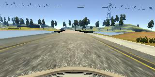 | 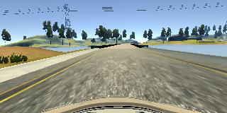 | 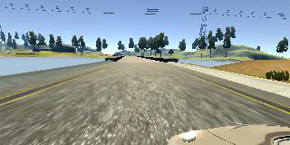| 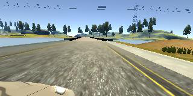 |
| Steering angle | -0.07 | 0.07 | 0.16 | -0.30 | 


Then to generalize a good driving behavior, I  recorded one lap on track but in ccw using center lane driving. Here is an example image of center lane driving in the reversed track:

|       | center image | fliplr image | left image | right image | 
| ----- | ------------ | ------------ | ---------- | ----------  |
| Images | 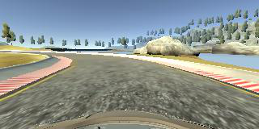 | 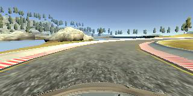 | 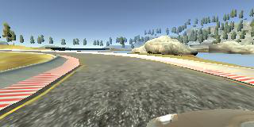| 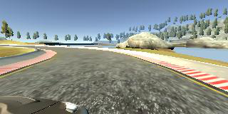 |
| Steering angle | -0.12 | 0.12 | 0.11 | -0.35 | 

I then recorded the vehicle turning in the sharpest curve so that the vehicle would learn to handle it, these images show what a curve looks like.

|       | center image | fliplr image | left image | right image | 
| ----- | ------------ | ------------ | ---------- | ----------  |
| Images | 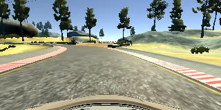 | 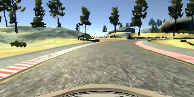 | 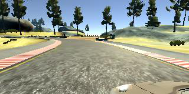| 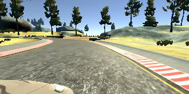 |
| Steering angle | 0.1 | -0.1 | 0.3 | -0.13 | 

Then I repeated this process on track two in order to get more data points.

The model was trained with more than 40,000 lines from different driving logs, including data augmentation images these are more than 160,000 images. The validation set, was 20% of the total images as described above. 

The model was trained using early stopping to prevent over fitting caused by too much training. The maximum epochs was set to 10. To evaluate the models performance, every epoch the validation loss was calculated, the final model trained for 8 epochs before stopping after no improvement for 2 epochs (PATIENCE: number of epochs set to wait for an improvement). So the final weights were from the model after 6 epochs, it can be accesed [here](model.h5)


